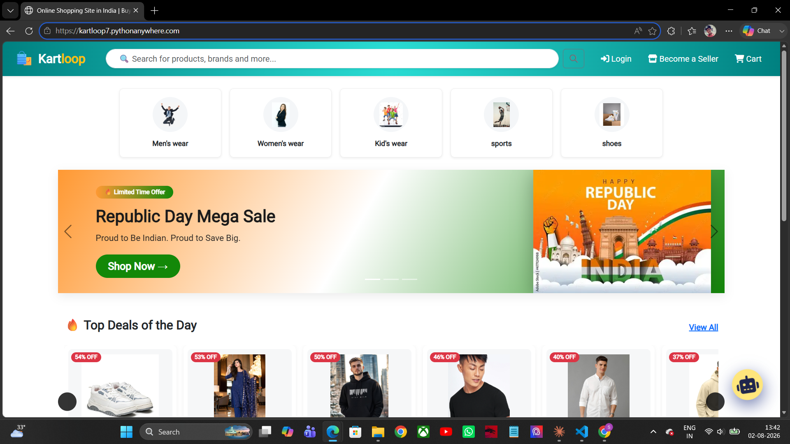
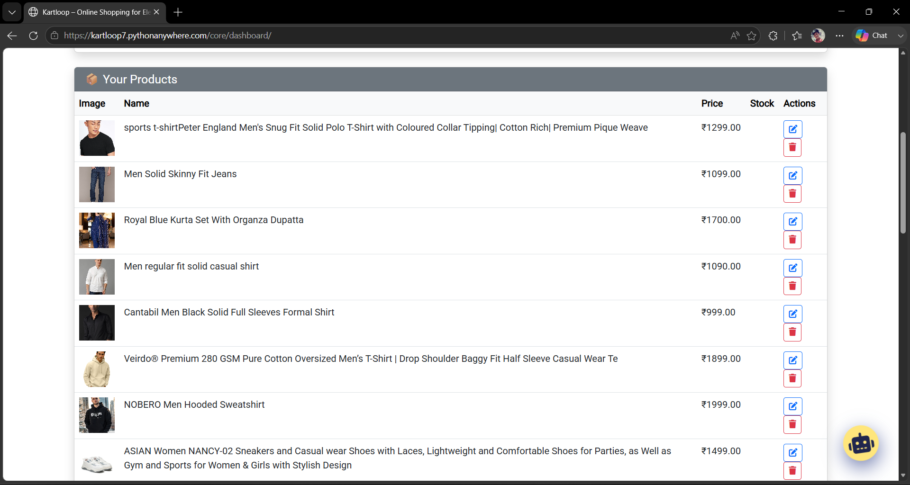
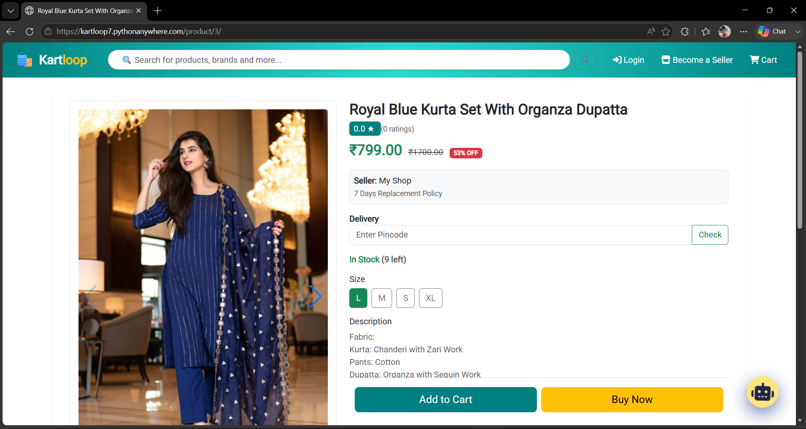
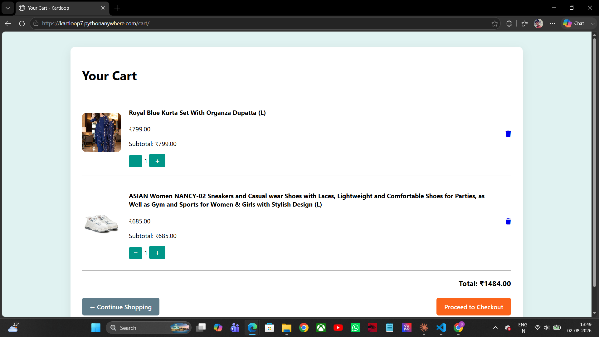
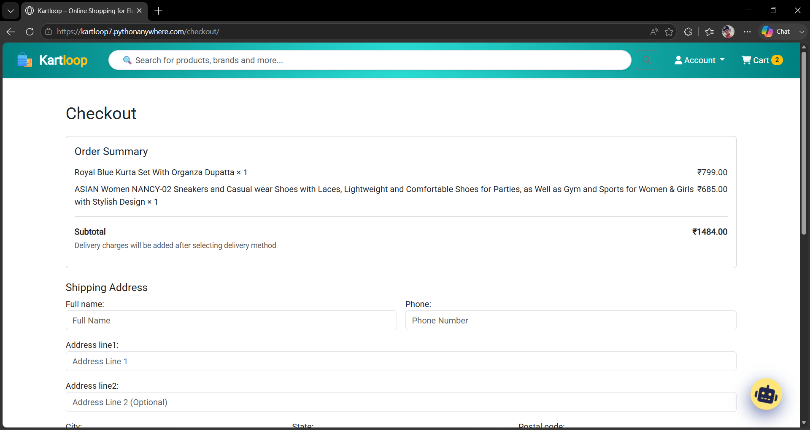
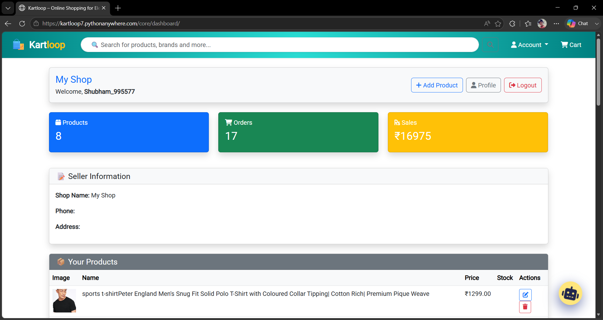
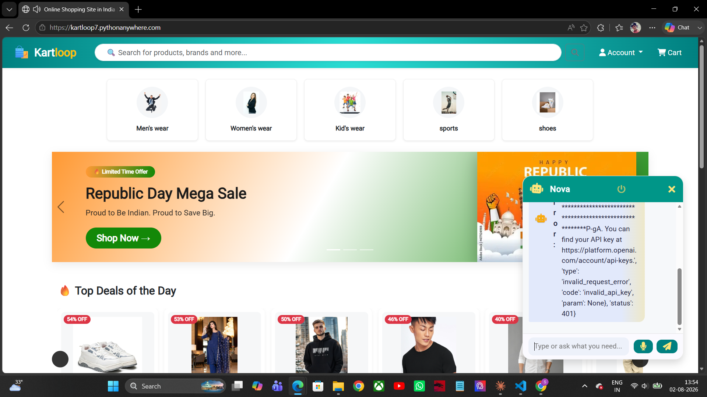
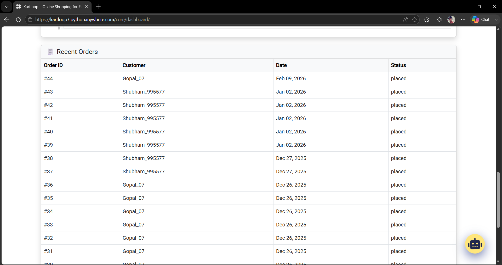

<div align="center">

# 🛒 KartLoop

### AI-Powered Multi-Vendor eCommerce Platform


<br>

[]()
[]()
[]()
[]()
[]()
[]()

### 🚀 Live Website

## https://kartloop7.pythonanywhere.com/

</div>

---

# 📖 About KartLoop

KartLoop is a **modern AI-powered Multi-Vendor eCommerce Marketplace** where multiple vendors can sell products through a single platform.

The platform provides a complete online shopping experience including secure authentication, vendor dashboards, AI shopping assistance, product management, order tracking, ratings & reviews, email notifications, and Shiprocket integration.

It has been built using **Django** following modern web development practices with a responsive Bootstrap interface.

---

# ✨ Key Features

## 👥 User Module

- User Registration
- Secure Login & Logout
- Profile Management
- Shopping Cart
- Checkout
- Order History
- Wishlist
- Recently Viewed Products

---

## 🛍 Shopping Features

- Product Search
- Product Categories
- Product Variants
- Product Reviews
- Product Ratings
- Related Products
- Dynamic Homepage
- Banner Slider
- Featured Products

---

## 🏪 Vendor Dashboard

- Add Products
- Edit Products
- Delete Products
- Product Management
- Vendor Dashboard
- Order Management

---

## 🤖 AI Shopping Assistant

✔ Intelligent Shopping Assistant

✔ Helps customers find products

✔ Product Recommendation Support

✔ Interactive User Experience

---

## 🚚 Shiprocket Integration

✔ Shipping API Integrated

✔ Shipment Creation

✔ Order Processing

✔ Ready for Live Shipping

---

## 📧 Email Notifications

✔ Email notification system implemented

✔ Order emails

✔ Registration emails

> **Note:** Email functionality is implemented and ready. It only requires SMTP/API credentials for production.

---

## ⭐ Reviews & Ratings

- Product Ratings
- Customer Reviews
- Dynamic Average Ratings

---

## 🔒 Security

- Django Authentication
- CSRF Protection
- Secure Password Hashing
- Admin Permissions
- Protected Vendor Routes

---

# 🏗 System Architecture

```text
                    User
                     │
                     ▼
            Django Web Application
                     │
     ┌───────────────┼────────────────┐
     │               │                │
     ▼               ▼                ▼

 Authentication   Product Module   Vendor Module
     │               │                │
     ▼               ▼                ▼

 AI Assistant   Cart & Checkout   Order System
                     │
                     ▼
            Shiprocket Integration
                     │
                     ▼
                  SQLite Database
```

---

# 💻 Technology Stack

| Category | Technology |
|-----------|------------|
| Backend | Django |
| Language | Python |
| Frontend | HTML5 |
| Styling | CSS3 |
| UI | Bootstrap 5 |
| Database | SQLite |
| Authentication | Django Auth |
| AI | AI Shopping Assistant |
| Shipping | Shiprocket API |
| Deployment | PythonAnywhere |

---

# 📸 Screenshots

Create a folder named

```
assets/
```

and add screenshots with these names.

```
assets/
│
├── home.png
├── login.png
├── register.png
├── products.png
├── product-detail.png
├── cart.png
├── checkout.png
├── dashboard.png
├── orders.png
├── reviews.png
├── ai-assistant.png
```

Then GitHub will automatically display them.

## Home



---

## Product Listing



---

## Product Details



---

## Shopping Cart



---

## Checkout



---

## Vendor Dashboard



---

## AI Assistant



---

## Orders



---

# 🚀 Installation

Clone Repository

```bash
git clone https://github.com/shubham99557/kartloop.git
```

Go inside project

```bash
cd kartloop
```

Create Virtual Environment

```bash
python -m venv .venv
```

Windows

```bash
.venv\Scripts\activate
```

Linux

```bash
source .venv/bin/activate
```

Install Requirements

```bash
pip install -r requirements.txt
```

Apply Migrations

```bash
python manage.py migrate
```

Create Superuser

```bash
python manage.py createsuperuser
```

Run Server

```bash
python manage.py runserver
```

Visit

```
http://127.0.0.1:8000/
```

---

# 📂 Project Structure

```
KartLoop
│
├── accounts
├── core
├── dashboard
├── static
├── media
├── templates
├── kartloop
├── manage.py
├── requirements.txt
└── README.md
```

---

# 🚀 Current Modules

✅ Authentication

✅ Vendor Dashboard

✅ Product Management

✅ Categories

✅ Product Variants

✅ Shopping Cart

✅ Checkout

✅ Order Management

✅ Reviews & Ratings

✅ AI Shopping Assistant

✅ Shiprocket Integration

✅ Email Notification System

✅ Dynamic Homepage

✅ Banner Management

---

# 📈 Future Enhancements

- Payment Gateway Integration (Razorpay/Stripe)
- AI Product Recommendation Engine
- Inventory Analytics
- Sales Dashboard
- Multi-language Support
- Mobile Application
- OTP Login
- Coupons & Offers
- Chat Between Buyer & Seller
- Advanced Search Filters

---

# 👨‍💻 Developer

## **Shubham Raj**

**B.Tech Computer Science & Engineering**

Python Developer • Django Developer • Full Stack Developer

---

### 🌐 Portfolio

https://shubham99557.github.io/portfolio/

### 💼 LinkedIn

https://www.linkedin.com/in/shubham-raj-313740285/

### 💻 GitHub

https://github.com/shubham99557

### 📧 Email

shubham202300334@smit.smu.edu.in

---

# ⭐ Support

If you like this project,

⭐ Star this repository.

🍴 Fork it.

📢 Share it with others.

---

# 📜 License

This project is released under the **MIT License**.

---

<div align="center">

## ⭐ Thank You for Visiting KartLoop ⭐

Made with ❤️ by **Shubham Raj**

</div>
